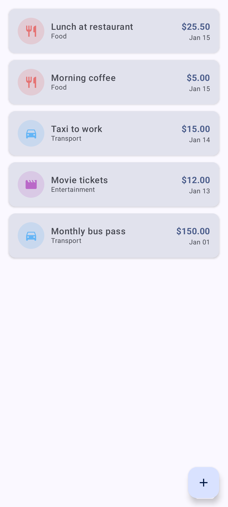
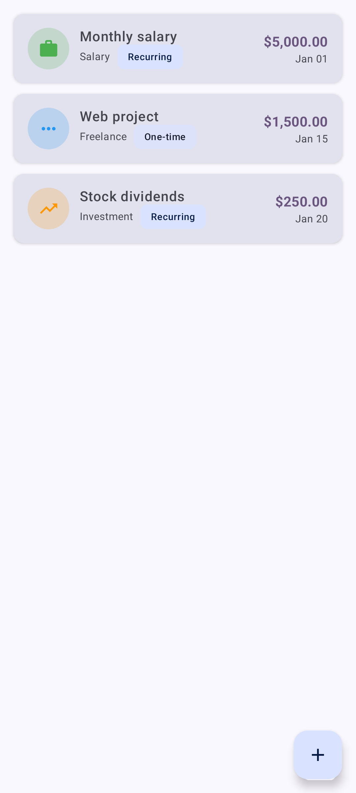
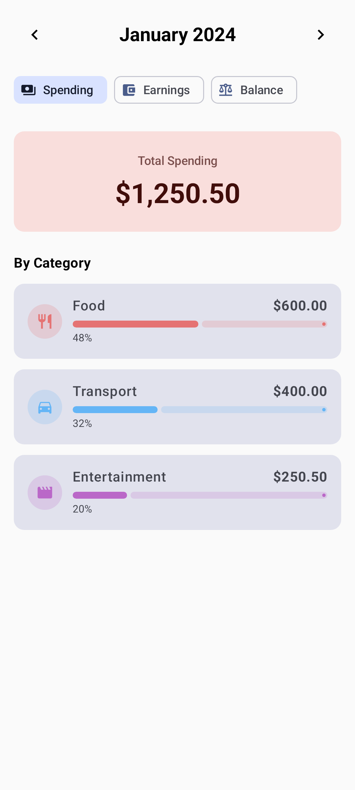
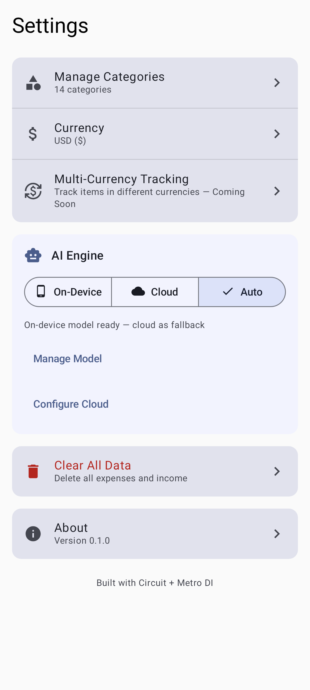

# Insight

**A personal finance Android app with AI-powered features — smart expense categorization and a financial insights chat powered by both cloud and on-device inference.**

[](https://kotlinlang.org)
[](https://developer.android.com)
[](https://github.com/shaharKeisarApps/Insight/actions/workflows/ci.yml)
[](LICENSE)

---

## Overview

Insight is a full-featured personal finance tracker that uses AI to make managing money easier. Add an expense and the app suggests the right category. Have a question about your spending? Ask the AI chat — it queries your financial data and provides insights in natural language.

The AI system supports two inference backends that can run independently or together:

- **Cloud AI** (Koog + OpenAI) — High-quality responses using GPT models with tool-calling for querying expenses, income, and reports
- **On-Device AI** (Llamatik + llama.cpp) — Fully offline inference using local GGUF models, with no API costs or data leaving the device

Users can switch between Local, Cloud, or Auto mode directly from Settings. In Auto mode, the app prefers on-device inference and falls back to cloud when needed.

---

## Screenshots

| Expenses | Income | Reports | AI Chat | Settings |
|----------|--------|---------|---------|----------|
|  |  |  |  |  |

---

## Architecture

```
                    ┌────────────┐
                    │    App     │  AppGraph (Metro DI root)
                    │ MainActivity│  NavigationSuiteScaffold
                    └─────┬──────┘
                          │
          ┌───────┬───────┼───────┬───────┐
          ▼       ▼       ▼       ▼       ▼
     ┌─────────┐ ┌─────┐ ┌───────┐ ┌──────┐ ┌────────┐
     │Expenses │ │Income│ │Reports│ │AI Chat│ │Settings│
     │ Screen  │ │Screen│ │Screen │ │Screen│  │ Screen │
     └────┬────┘ └──┬──┘ └───┬───┘ └──┬───┘ └───┬────┘
          │         │        │        │          │
     Circuit Presenters + @CircuitInject + Metro @AssistedInject
          │         │        │        │          │
          ▼         ▼        ▼        ▼          ▼
     ┌──────────────────────────────────────────────┐
     │              Core Modules                     │
     │  ┌──────┐ ┌────┐ ┌──────────┐ ┌────┐ ┌────┐ │
     │  │ data │ │ db │ │   model  │ │ ui │ │ ai │ │
     │  └──────┘ └────┘ └──────────┘ └────┘ └──┬─┘ │
     └──────────────────────────────────────────┼───┘
                                                │
                                   ┌────────────┤
                                   ▼            ▼
                              ┌────────┐  ┌──────────┐
                              │  Koog  │  │ Llamatik │
                              │ (Cloud)│  │ (Local)  │
                              └────────┘  └──────────┘
```

**Key rules:**
- Feature modules never depend on other features
- Features only depend on core modules
- `AiServiceStrategy` selects cloud or local AI automatically

---

## Tech Stack

| Technology | Version | Purpose |
|------------|---------|---------|
| **Kotlin** | 2.3.0 (K2) | Language with K2 compiler |
| **Jetpack Compose** | BOM 2025.12.01 | Declarative UI |
| **Metro DI** | 0.9.2 | Compile-time dependency injection |
| **Circuit** | 0.31.0 | MVI architecture & navigation |
| **SQLDelight** | 2.2.1 | Type-safe SQL database |
| **Koog** | 0.6.0 | Cloud AI agent framework (OpenAI) |
| **Llamatik** | 0.16.0 | On-device LLM inference (llama.cpp) |
| **Ktor** | 3.1.3 | HTTP client |
| **Material 3** | Latest | Design system with dynamic color |

**Requirements:** Min SDK 33 (Android 13) · Target SDK 36 · JDK 21

---

## AI Integration

### Smart Category Suggestion

When adding an expense, the AI analyzes the description and suggests the most appropriate category — reducing manual input and improving data consistency.

### Financial Insights Chat

The AI chat screen lets users ask natural language questions about their finances. The AI has access to tool functions that query the local database:

```kotlin
@ContributesBinding(AppScope::class)
@Inject
class AiServiceStrategy(
    private val llamatikAiService: LlamatikAiService,  // local
    private val koogAiService: KoogAiService,           // cloud
) : AiService {
    var mode: AiMode = AiMode.AUTO  // LOCAL | CLOUD | AUTO
}
```

Example queries: *"How much did I spend on food this month?"*, *"What's my biggest expense category?"*, *"Compare my income vs spending."*

---

## Module Structure

```
Insight/
├── app/                     # Entry point, AppGraph, navigation
├── build-logic/             # Gradle convention plugins
├── core/
│   ├── common/              # AppScope, shared utilities
│   ├── model/               # Domain models (Expense, Income, Category)
│   ├── database/            # SQLDelight schema and drivers
│   ├── data/                # Repository interfaces and implementations
│   ├── designsystem/        # Material3 theme (InsightTheme)
│   ├── ui/                  # Shared UI components
│   └── ai/                  # Dual AI service (Koog + Llamatik)
└── feature/
    ├── expenses/            # Expense tracking with AI categorization
    ├── income/              # Income management
    ├── reports/             # Financial reports and analytics
    ├── ai-chat/             # AI chat with financial tools
    └── settings/            # App settings and AI mode selection
```

---

## Build & Run

```bash
# Clone
git clone https://github.com/shaharKeisarApps/Insight.git
cd Insight

# (Optional) Enable cloud AI
echo "OPENAI_API_KEY=sk-your-key" >> local.properties

# Build
./gradlew assembleDebug

# Test
./gradlew test
```

### On-Device AI Setup (Optional)

Place a GGUF model in the app's files directory to enable local inference:

```bash
adb push phi-2.Q4_0.gguf /data/data/com.keisardev.insight/files/models/
```

Recommended models: Phi-2 Q4_0 (~1.6 GB) for chat, any small model for categorization.

---

## License

```
Copyright 2025 Keisardev

Licensed under the Apache License, Version 2.0 (the "License");
you may not use this file except in compliance with the License.
You may obtain a copy of the License at

    http://www.apache.org/licenses/LICENSE-2.0

Unless required by applicable law or agreed to in writing, software
distributed under the License is distributed on an "AS IS" BASIS,
WITHOUT WARRANTIES OR CONDITIONS OF ANY KIND, either express or implied.
See the License for the specific language governing permissions and
limitations under the License.
```
